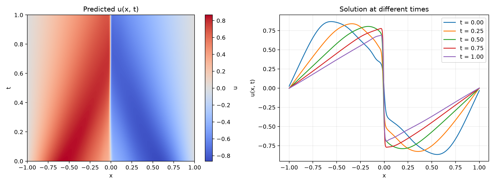
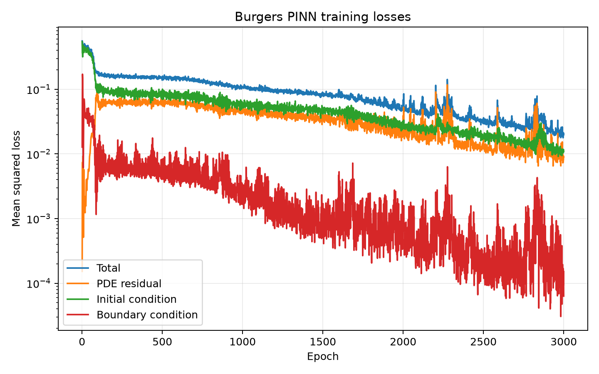
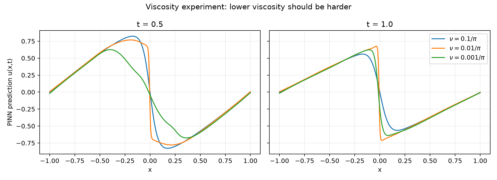
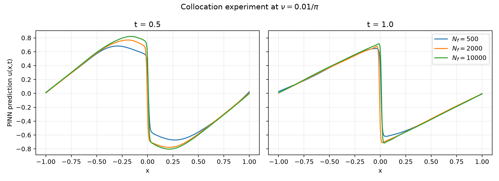
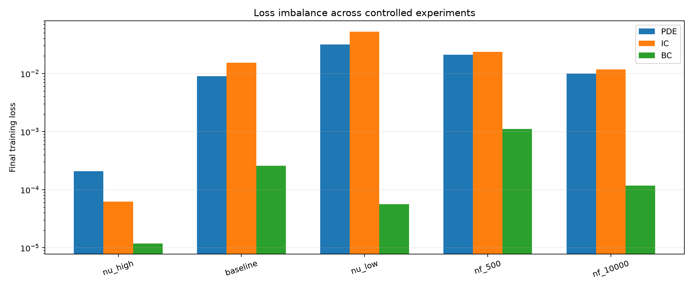

# Burgers 方程 PINN（PyTorch）

这个小项目只用物理方程、初始条件和边界条件训练神经网络，不需要内部真实解数据。

## 问题定义

在区域 \(x\in[-1,1]\)、\(t\in[0,1]\) 上求解

\[
u_t + u u_x - \nu u_{xx}=0,
\]

其中默认 \(\nu=0.01/\pi\)，并满足

\[
u(x,0)=-\sin(\pi x),\qquad u(-1,t)=u(1,t)=0.
\]

网络输入是 `(x, t)`，输出是 `u(x, t)`。训练损失为

\[
L=L_{PDE}+L_{IC}+L_{BC}.
\]

`u_t`、`u_x` 和 `u_xx` 全部由 PyTorch 自动微分计算。

## 在 VS Code 中运行

本机的 `.venv` 已配置好，VS Code 会自动选中它。打开“运行和调试”面板后，可以直接选择：

- `PINN: 快速检查`：20 轮小规模测试
- `PINN: 完整训练`：使用默认配置训练 3000 轮

也可以在 VS Code 终端直接执行：

```bash
source .venv/bin/activate
python train_burgers_pinn.py
```

如果将项目复制到另一台电脑，推荐用稳定版 Python 3.10 或更高版本重新创建环境：

```bash
python3 -m venv .venv
source .venv/bin/activate
python -m pip install -r requirements.txt
```

Windows PowerShell 激活环境时使用：

```powershell
.venv\Scripts\Activate.ps1
```

完整训练也可以明确写成：

```bash
python train_burgers_pinn.py
```

如果电脑较慢，可先执行快速检查：

```bash
python train_burgers_pinn.py --epochs 20 --n-f 128 --n-ic 64 --n-bc 64 --hidden-width 32 --hidden-layers 2 --output-dir smoke-results
```

如果有 NVIDIA GPU，程序会自动使用 CUDA；也可以明确指定：

```bash
python train_burgers_pinn.py --device cuda
```

## 输出文件

训练完成后，`results/` 中会生成：

- `burgers_pinn.pt`：模型参数与配置
- `loss_history.csv`：每轮的四类损失数值
- `loss_curves.png`：总损失、PDE、初始条件和边界条件曲线
- `solution.png`：预测解热图和多个时刻的解曲线

## 最值得观察的代码

1. `BurgersPINN`：全连接 `tanh` 网络如何实现 `(x,t) -> u`。
2. `pde_residual`：自动微分如何连续计算一阶、二阶导数。
3. `compute_losses`：随机配置点和三个损失项如何组成总损失。
4. `train`：Adam 如何最小化物理约束损失。

默认配置偏向可读性和普通电脑可运行性。PINN 结果受随机采样、训练轮数和网络规模影响；如果解仍偏平滑，可增加 `--epochs`、`--n-f` 或网络宽度。

## Baseline 结果

默认配置训练 3000 轮后的预测与 loss：





## PINN limitations 对照实验

运行全部控制变量实验：

```bash
python run_limitations_experiments.py
```

实验包括：

- 黏性：`nu = 0.1/pi, 0.01/pi, 0.001/pi`
- PDE 配置点：`N_f = 500, 2000, 10000`
- 分别比较 PDE、IC 和 BC loss

### 黏性与 steep-gradient limitation



低黏性理论解应该更陡，但最低黏性组得到过度平滑的预测，并具有最大的 PDE 与 IC 误差，展示了 PINN 对 sharp features 的训练困难。

### Collocation sampling



从 500 增加至 2000 个配置点改善明显；继续增加到 10000 后收益减小，说明单纯均匀增加点数成本较高，也为 adaptive sampling 提供了动机。

### Loss imbalance



困难组的 BC loss 已经很低，但 PDE 与 IC loss 仍高出多个数量级，说明三种约束的优化难度并不相同。

详细数值和解释见 [`experiments/REPORT.md`](experiments/REPORT.md)，汇总指标见 [`experiments/metrics_summary.csv`](experiments/metrics_summary.csv)。

## PINN limitation 对照实验

一键运行黏性系数、配置点数量和三项 loss 对照实验：

```bash
python run_limitations_experiments.py
```

脚本固定网络、Adam、3000 轮和随机种子，只改变一个实验变量。它会运行五个不重复的配置：

- `nu_high`：`nu=0.1/pi, N_f=2000`
- `baseline`：`nu=0.01/pi, N_f=2000`
- `nu_low`：`nu=0.001/pi, N_f=2000`
- `nf_500`：`nu=0.01/pi, N_f=500`
- `nf_10000`：`nu=0.01/pi, N_f=10000`

结果保存在 `experiments/`，包括各模型、各项 loss、解图、对比图和固定验证点上的 `metrics_summary.csv`。
