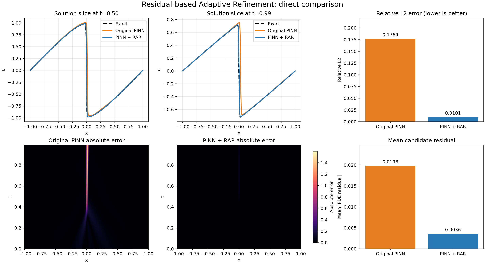
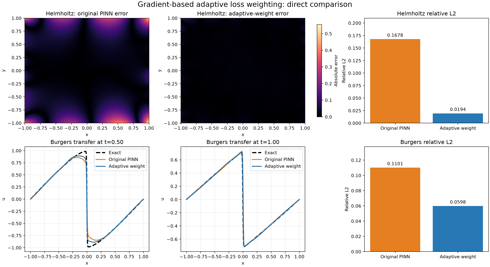

# 2026-09-10：RAR 与自适应损失加权复现

这一部分承接仓库中的 Burgers PINN baseline 和 limitations 实验。学习逻辑是：

```text
固定均匀采样遗漏陡峭区 -> RAR 把点加到高 residual 区域
PDE/IC/BC 梯度不平衡 -> 根据反向传播梯度动态调节 loss 权重
```

## 1. Residual-based Adaptive Refinement

代码改写自 DeepXDE 官方 [`Burgers_RAR.py`](https://github.com/lululxvi/deepxde/blob/master/examples/pinn_forward/Burgers_RAR.py)。保留的关键设置：

- Burgers 方程，`nu=0.01/pi`，`x in [-1,1]`、`t in [0,0.99]`；
- 2500 个域内点、100 个边界点、160 个初值点；
- `2-20-20-20-1` tanh 网络；
- Adam 10000 步，然后 L-BFGS；
- 在 100000 个候选点中找到最大 residual；
- 每轮只永久增加 1 个点，再充分训练；
- 平均候选 residual 小于 0.005 时停止。

本次结果：

| 模型 | 相对 L2 | 平均候选 residual |
|---|---:|---:|
| 原始 PINN | 0.17689 | 0.019806 |
| PINN + RAR | **0.010067** | **0.003628** |



图中黑色虚线是 Cole-Hopf 参考解，橙色是原始 PINN，蓝色是 RAR。两张误差热图使用同一色标。RAR 把一个新点加在 `(x,t) approx (0.0333,0.9886)`，即晚时刻中央陡峭层附近；保留全域原始点、少量增加困难点，避免了教学版一次选择大量 top-k 点造成的采样坍缩。

原始数据见 [`rar/rar_cycles.csv`](rar/rar_cycles.csv)。

## 2. Gradient-based Adaptive Loss Weighting

依据 Wang、Teng、Perdikaris 的[原论文](https://doi.org/10.1137/20M1318043)及[作者代码](https://github.com/PredictiveIntelligenceLab/GradientPathologiesPINNs)移植。

原始 PINN 的问题是：loss 系数都等于 1，不代表不同 loss 对参数产生的梯度一样大。作者用 PDE 梯度最大值与约束梯度平均值的比例更新权重，并使用 `beta=0.9` 的指数滑动平均。

保留的主要官方设置：

- 原论文 Helmholtz 问题；
- `2-50-50-50-1` tanh 网络；
- mini-batch 128，训练 40001 次；
- Adam 初始学习率 `1e-3`，连续指数衰减；
- 每 10 步更新一次动态权重；
- M1 为固定权重，M2 为动态权重。

结果：

| 问题 | 原始 PINN | 自适应加权 | 误差下降 |
|---|---:|---:|---:|
| 原论文 Helmholtz | 0.16778 | **0.019418** | 88.4% |
| Burgers 迁移实验 | 0.11012 | **0.059841** | 45.7% |



Helmholtz 才是论文原实验；Burgers 是使用相同算法做的迁移验证。教学版使用未加权梯度作分母、每 100 epoch 更新并把权重截断到 100，容易过度强调 IC/BC；作者算法每 10 步更新，而且当前权重进入分母形成负反馈，因此没有出现相同的饱和。

汇总数值见 [`adaptive_weight/metrics_summary.csv`](adaptive_weight/metrics_summary.csv)。

## 运行

```bash
python -m pip install deepxde scipy
python run_paper_rar.py
python run_paper_adaptive_weight.py
python make_paper_comparison_figures.py
```

最后一条命令只读取已经训练好的模型生成对照图。仓库不上传模型 checkpoint；从 GitHub 新下载后，应先运行前两个训练脚本，再生成对照图。
