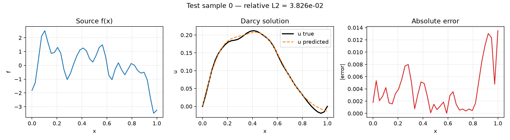
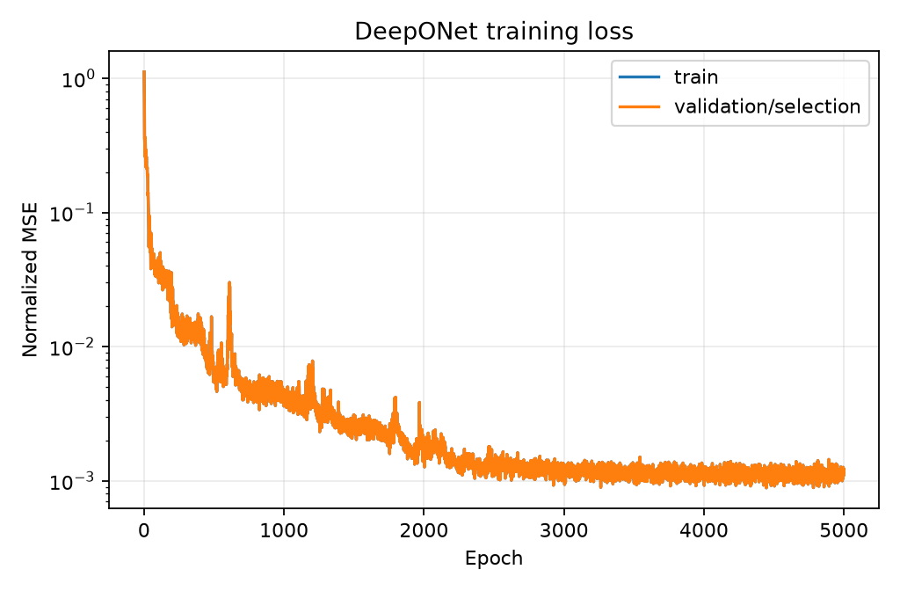

# 2026-09-14：Cornell DeepONet 1D nonlinear Darcy 复现

这是一个可直接运行的 PyTorch 项目，复现 Cornell Scientific Machine Learning 教程里的 1D nonlinear Darcy → DeepONet 流程，并补上教程代码未提供的收敛诊断、验证集支持、完整测试指标、模型保存和作图。

## 学习位置

前一个 Burgers PINN 实验针对一个固定 PDE 实例训练一个网络。本实验进入 neural operator：先用传统 PDE solver 生成许多 `(source f, solution u)` 配对，再训练 DeepONet 学习整个算子

\[
G:f(x)\mapsto u(x).
\]

训练完成后，同一个 DeepONet 可以直接预测新的 source function 对应的解，不必像普通 PINN 那样为每个新实例重新训练。

## 复现证据等级

本实验属于 **A：官方教程代码复现 + 工程化增强**。PDE、随机场、离散索引、网络和训练参数来自 Cornell 页面及其官方课程 notebook；模块化 CLI、双收敛判据、全测试集指标和结果保存是本项目新增内容。具体差异见“与 Cornell 教程的对齐和差异”。

参考页面：

- [DeepONet 教程入口](https://cvw.cac.cornell.edu/SciML/deeponet/index)
- [Nonlinear Darcy problem](https://cvw.cac.cornell.edu/SciML/deeponet/deeponet-nonlinear-darcy-problem)
- [DeepONet architecture](https://cvw.cac.cornell.edu/SciML/deeponet/deeponet-architecture)
- [Cornell Lab / notebook 说明](https://cvw.cac.cornell.edu/SciML/deeponet/Jupyter-notebook-lab)
- [课程官方 notebook](https://github.com/chishiki-ai/sciml-course/blob/main/SciML/03a_deeponet.ipynb)

## 1. 问题与数值方法

方程为

\[
\frac{d}{dx}\left(-\kappa(u)\frac{du}{dx}\right)=f(x),\qquad
\kappa(u)=0.2+u^2,\qquad u(0)=u(1)=0.
\]

项目把它分成四层：

1. 在均匀网格上用保守通量有限差分把 PDE 变成三对角线性系统。
2. Picard/fixed-point iteration 冻结当前的 \(\kappa(u^k)\)。
3. 用 `scipy.sparse.linalg.spsolve` 解每一步的稀疏系统。
4. 用欠松弛更新 \(u^{k+1}=0.5u_*+0.5u^k\)，再检查更新量和真实非线性残差。

Cornell 原代码把每个面上的系数取为其左节点值。令

\[
\kappa_{i+1/2}=\kappa_i,
\qquad q_{i+1/2}=-\kappa_{i+1/2}\frac{u_{i+1}-u_i}{h},
\]

则内部方程为

\[
\frac{q_{i+1/2}-q_{i-1/2}}{h}=f_i.
\]

这正是默认的 `face_scheme="cornell_left"`。代码也提供 `face_scheme="arithmetic"`，它用相邻节点的算术平均作为面系数，是更常见的二阶做法，但不是 Cornell 页面原实现。

收敛同时要求

\[
\frac{\lVert u^{k+1}-u^k\rVert_2}{\max(\lVert u^{k+1}\rVert_2,1)}
\leq \text{update\_tol}
\]

以及

\[
\frac{\lVert R(u^{k+1})\rVert_2}{\max(\lVert f\rVert_2,1)}
\leq \text{residual\_tol}.
\]

残差会用更新后的 \(u^{k+1}\) 重新计算 nonlinear permeability，避免把冻结线性系统几乎为零的残差误当作非线性收敛。

## 2. 随机 source 与 DeepONet

source function 来自 Cornell 使用的零均值高斯过程

\[
f\sim\mathcal{GP}(0,K),\qquad
K(x,x')=\sigma^2\exp\left(-\frac{|x-x'|^2}{2\ell^2}\right),
\]

默认 \(\ell=0.04\)、\(\sigma^2=1\)，协方差矩阵加 `1e-6 I`。`cornell_scipy` 采样模式使用 `scipy.stats.multivariate_normal.rvs` 和 seed 42。

DeepONet 的 Branch 输入一整条 source 在 40 个 sensors 上的值：

\[
\mathbf f=[f(x_0),\ldots,f(x_{39})].
\]

Trunk 输入查询坐标 \(x\)。两边输出相同的 latent 维度 \(p\)，然后作内积：

\[
G_\theta(f)(x)=\sum_{k=1}^{p}b_k(\mathbf f)t_k(x)+b_0.
\]

具体 Darcy notebook 没有实现公式里的 \(b_0\)，因此两个配置默认 `output_bias=false`。完整网络为：

- Branch：`40 → 256 → GELU → 256 → GELU → 128`
- Trunk：`1 → 256 → GELU → 256 → GELU → 128`
- 参数量：208,384

只有 target solution 使用训练集的全局 mean/std 标准化；source 和坐标不标准化，与 Cornell 代码一致。

## 3. 安装与运行

建议 Python 3.10 或更新版本。

```bash
python -m venv .venv
source .venv/bin/activate       # Windows: .venv\Scripts\activate
python -m pip install -r requirements.txt
python -m pip install -e .
```

一键 smoke test（CPU，小数据、12 epochs）：

```bash
python -m deeponet_darcy.cli run \
  --config configs/smoke.json \
  --output-dir runs/quick-smoke
```

运行 Cornell 风格完整配置：

```bash
python -m deeponet_darcy.cli run \
  --config configs/full.json \
  --output-dir runs/full
```

完整配置要生成 1000 条 PDE 样本并训练 5000 epochs，耗时取决于 CPU/GPU。SciPy PDE 数据生成只使用 CPU；GPU/MPS 只加速 DeepONet。

也可以分阶段运行：

```bash
python -m deeponet_darcy.cli generate --config configs/smoke.json --output-dir runs/manual
python -m deeponet_darcy.cli train    --config configs/smoke.json --output-dir runs/manual
python -m deeponet_darcy.cli evaluate --config configs/smoke.json --output-dir runs/manual
```

运行单元测试：

```bash
python -m unittest discover -s tests -v
```

## 4. 项目文件

```text
configs/smoke.json             小规模快速配置
configs/full.json              Cornell 风格完整配置
src/deeponet_darcy/darcy.py    通量离散、Picard、欠松弛、残差、spsolve
src/deeponet_darcy/data.py     GRF source 采样、批量 PDE 标签生成、NPZ I/O
src/deeponet_darcy/model.py    Branch/Trunk DeepONet
src/deeponet_darcy/train.py    训练、目标标准化、scheduler、checkpoint
src/deeponet_darcy/evaluate.py 指标、预测文件与图片
src/deeponet_darcy/pipeline.py generate/train/evaluate 流程编排
src/deeponet_darcy/cli.py      命令行入口
tests/                         PDE 离散制造解和网络形状测试
```

每次运行目录包含：

```text
resolved_config.json           实际配置
data.npz                       x 与 train/val/test 的 f、u
solver_stats.json              收敛数、迭代数、最大 nonlinear residual
last.pt                        最后一个模型 checkpoint
best.pt                        有验证集时的最佳 checkpoint
history.csv                    epoch/train_loss/val_loss/lr
metrics.json                   全测试集误差指标
predictions.npz                测试集 u_true、u_pred、逐样本误差
loss_curve.png                 loss 曲线
prediction_sample_*.png        f、u_true/u_pred、绝对误差三联图
```

`metrics.json` 给出 MSE、RMSE、MAE、整体 relative L2，以及逐样本 relative L2 的 mean/median/max。逐样本指标定义为

\[
\frac{\lVert u_{pred}-u_{true}\rVert_2}{\lVert u_{true}\rVert_2+\epsilon}.
\]

## 5. 关键配置

| 字段 | 含义 |
|---|---|
| `pde.n_grid` | PDE 网格点数，同时也是 Branch sensor 数 |
| `pde.max_iter` | Picard 最大迭代数 |
| `pde.relaxation` | 欠松弛系数，Cornell 为 0.5 |
| `pde.update_tol` | 相对更新量阈值 |
| `pde.residual_tol` | 相对 nonlinear residual 阈值 |
| `pde.face_scheme` | `cornell_left` 或 `arithmetic` |
| `pde.stop_on_convergence` | true 时达标即提前停止；false 时仍做满 `max_iter` |
| `data.length_scale` | GRF kernel 的 \(\ell\) |
| `data.source_amplitude` | GRF 的 \(\sigma\) |
| `model.latent_dim` | Branch/Trunk 公共 latent 维数 \(p\) |
| `training.sampling` | `cornell_random_batch` 每 epoch 只抽一个 batch；`full_epoch` 遍历训练集 |

若 PDE 不收敛，优先减小 `source_amplitude` 或 `relaxation`，也可提高 `max_iter`。数据生成器遇到未收敛样本会直接报出 sample index，不会静默把坏标签用于训练。

## 6. 与 Cornell 教程的对齐和差异

| 项目 | Cornell 页面/notebook | 本项目 |
|---|---|---|
| PDE/边界/κ | `d/dx(-κu_x)=f`，零 Dirichlet，`κ=0.2+u²` | 相同 |
| 空间离散 | permeability 左节点作为 face 系数 | 默认精确采用；另提供 `arithmetic` |
| 非线性迭代 | 固定 100 次，0.5 欠松弛 | full 做满 100 次；smoke 达标后早停 |
| 收敛检查 | 无 | 新增 relative update + true nonlinear residual 双判据 |
| 随机输入 | 1000 条、40 点、ℓ=0.04、seed 42、jitter 1e-6 | full 相同 |
| 数据划分 | 前 80% train，后 20% test | full 相同；smoke 另设 8 条 validation |
| 网络 | hidden 256×2，GELU，p=128，无 output bias | full 相同 |
| 训练采样 | 每 epoch 随机选 64 条，仅一次更新 | full 相同；可切换 full epoch |
| 优化 | Adam 1e-3、weight decay 1e-5、CosineAnnealing 5000 | full 相同 |
| target 标准化 | 训练 solution 的全局 mean/std | 相同，且统计量写入 checkpoint |
| 模型选择 | 训练最终模型，无 validation | full 保存/evaluate `last.pt`；smoke 有 validation 时保存 `best.pt` |
| 评估 | 前 5 条合并 relative L2 和 true/pred 图 | 增加全测试集指标、逐样本统计、误差图和 NPZ |

命名上，Cornell notebook 的 `U` 实际表示 source \(f\)，`S` 表示 solution \(u\)。本项目统一采用数学上更直观的 `f_*` 和 `u_*`，避免把输入和解混淆。

## 7. 已完成的完整训练

此次在 CPU 上实际生成 1000 条 PDE 样本并完成 5000 epochs：1000/1000 条 PDE 均收敛，最大相对 nonlinear residual 为 `5.62e-14`；网络参数量为 208,384。全体 200 条测试样本的 global relative L2 为 `0.03736`，RMSE 为 `0.00564`，前 5 条测试样本合并 relative L2 为 `0.03334`，与 Cornell notebook 报告的约 `0.0306` 处于同一量级。

| 结果 | Cornell notebook | 本次复现 |
|---|---:|---:|
| 前 5 条合并 relative L2 | 约 0.0306 | 0.03334 |
| 全部 200 条 global relative L2 | 未报告 | 0.03736 |
| 全部测试集 RMSE | 未报告 | 0.00564 |
| PDE 样本收敛数 | 未报告 | 1000/1000 |



图中黑线是 nonlinear Darcy solver 生成的真解，橙色虚线是 DeepONet 对未见 source 的预测，右侧是逐坐标绝对误差。



每个 epoch 按 Cornell 方式随机抽取 64 条函数，只执行一次参数更新，因此 loss 有小批量波动；总体从约 `1.12` 降至 `1e-3` 量级。

详细数值见 [`results/metrics_summary.csv`](results/metrics_summary.csv) 和 [`results/solver_summary.csv`](results/solver_summary.csv)。按照仓库管理规范，GitHub 提交保留可复现源码、配置、汇总指标和关键图片，不上传虚拟环境、PDE 数据集、完整逐 epoch 日志或模型 checkpoint；它们可通过 `full.json` 重新生成。

网络结构没有硬编码零 Dirichlet 边界；本次 200 条测试预测的端点最大绝对值为 `0.02079`，边界是通过数据学习得到的近似值。若需要严格满足边界，可以额外使用 `x(1-x)` 输出变换，但这会偏离 Cornell 原始模型。
